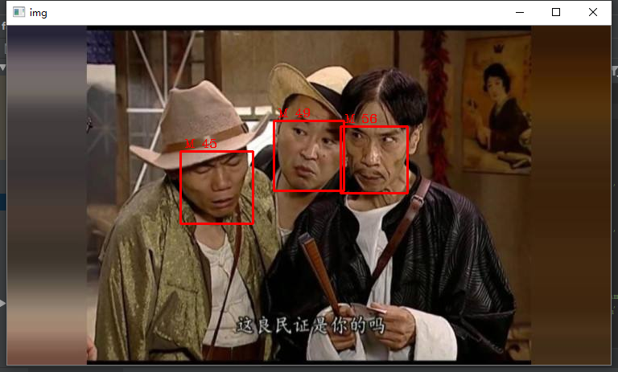

# facedetector
A simple face detector, which will give gender and age information, based on face++.

基于Face++的简单人脸识别程序，使用cv2圈出人脸位置，并显示性别和年龄信息。
程序很简单，基于Face++提供的人脸识别代码样例，样例代码提供了一个Face++人脸识别的调用接口，只需要补充完整key和secret以及添加一个完整可用的本地图片地址即可。

如：

```
key = "your key"
secret = "your secret"
filepath = r"1.jpg"
```

调用此接口将返回图片中人脸的相关数据，返回信息使用Json格式化处理一下，即可得到图片中的各种人脸信息。具体返回参数可以参考[官方API文档](https://console.faceplusplus.com.cn/documents/4888373)。

这里程序在此基础上使用cv2根据返回的信息对图片进行了处理，对人脸位置使用矩形方框圈出，并在图片上显示了人脸的性别以及年龄信息。整体很简单，没什么技术含量，只为填上几年前做的识别小程序的坑，以后也可以考虑使用自己训练的模型来进行识别。

效果如下：

原图

效果图
